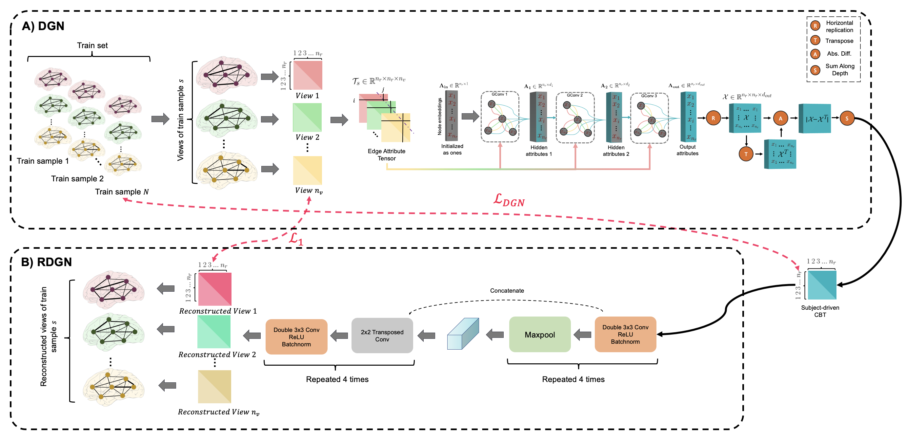
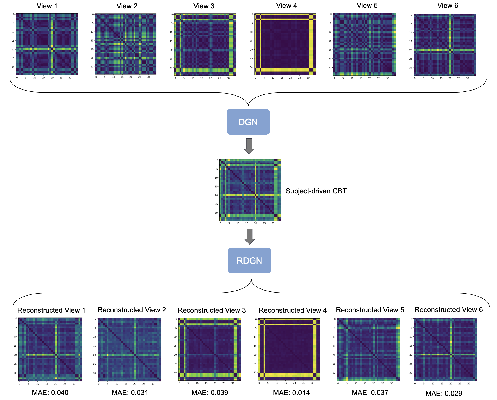
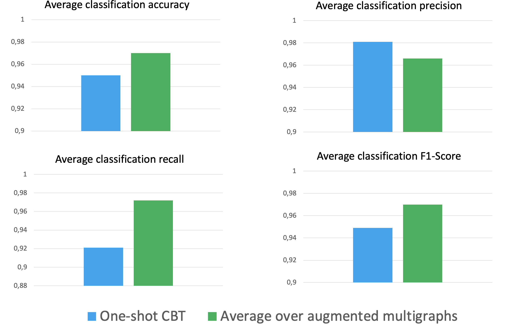

# MultigraphGNet
MultigraphGNet for generating/augmenting multi-view brain graphs using only a single view-brain graph.

Please contact furkan2pala@gmail.com for inquiries. Thanks. 



# Introduction
This work is accepted at the PRIME-MICCAI 2022 workshop, Singapore.

> **Predicting Brain Multigraph Population From a Single Graph Template for Boosting One-Shot Classification**
>
> Furkan Pala and Islem Rekik
>
> BASIRA Lab, Faculty of Computer and Informatics, Istanbul Technical University, Istanbul, Turkey
>
> **Abstract:** *A central challenge in training one-shot learning models is the limited representativeness of the available shots of the data space. Particularly in the field of network neuroscience where the brain is represented as a graph, such models may lead to low performance when classifying brain states (e.g., typical vs. autistic). To cope with this, most of the existing works involve a data augmentation step to increase the size of the training set, its diversity and representativeness. Though effective, such augmentation methods are limited to generating samples with the same size as the input shots (e.g., generating brain connectivity matrices from a single shot matrix). To the best of our knowledge, the problem of generating brain multigraphs capturing multiple types of connectivity between pairs of nodes (i.e., anatomical regions) from a single brain graph remains unsolved. In this paper, we unprecedentedly propose a hybrid graph neural network (GNN) architecture, namely Multigraph Generator Network or briefly MultigraphGNet, comprising two subnetworks: (1) a many-to-one GNN which integrates an input population of brain multigraphs into a single template graph, namely a connectional brain temple (CBT), and (2) a reverse one-to-many U-Net network which takes the learned CBT in each training step and outputs the reconstructed input multigraph population. Both networks are trained in an end-to-end way using a cyclic loss. Experimental results demonstrate that our MultigraphGNet boosts the performance of an independent classifier when trained on the augmented brain multigraphs in comparison with training on a single CBT from each class. We hope that our framework can shed some light on the future research of multigraph augmentation from a single graph.*

# Code
This project was implemented using Python and PyTorch.

## Installation
Clone this repo. Then, create a virtual env using the following command
```sh
python3 -m venv MultigraphGNet
```
Activate the virtual env using the following command (for Linux and OS X)
```sh
source MultigraphGNet/bin/activate
```
Activate the virtual env using the following command (for Windows)
```sh
MutligraphGNet\Scripts\activate.bat
```

Use `pip` to install dependencies. For cpu installation, use the following command
```sh
pip3 install torch scipy scikit-learn matplotlib torch-scatter torch-sparse torch-cluster torch-spline-conv torch-geometric -f https://data.pyg.org/whl/torch-1.12.0+cpu.html
```
For cuda installation, use the following commands. These commands are for CUDA version 11.3. Installation for a different version, please check out [PyTorch Geometric Docs](https://pytorch-geometric.readthedocs.io/en/latest/notes/installation.html) and [PyTorch Website](https://pytorch.org/).
```sh
pip3 install scipy scikit-learn matplotlib
pip3 install torch torchvision torchaudio --extra-index-url https://download.pytorch.org/whl/cu113
pip3 install torch-scatter torch-sparse torch-cluster torch-spline-conv torch-geometric -f https://data.pyg.org/whl/torch-1.12.0+cu113.html
```

## Dataset
We represent the data for a subject as a 3 dimensional tensor of shape `(N_ROI, N_ROI, N_VIEWS)`
where `N_ROI` is the number of region of interests in the brain and `N_VIEWS` is the number of views each capturing a different relation between the ROIs.

To create a simulated dataset, you can use `create_simulated_data.py` script.

## Config
In `config.py` file, you can change the number of samples, region of interests in the simulated dataset. You can train on your custom dataset as well by changing the paths in `DatasetClass1` and `DatasetClass2` classes. However, if your dataset has a different formant than `np.array (.npy)`, you need to write your function to read the dataset.

## Running the MultigraphGNet code
First, you need to run the `train_dgn_rdgn.py` script to train DGN and RDGN networks using K-Fold cross validation. You can specify the number of folds and seed for the train-test split in K-Fold CV. 

Once the training is done, you can see the testing results at `dgn_rdgn_results/` directory. Also, you can see the visualizations of the reconstructed views in the directory for each fold.

Then, you can run the `train_classifier.py` script to train two SVM classifiers. To evaluate the effectiveness of our framework, we train two independent SVM classifiers using
* one global CBT from each class (one-shot CBT baseline)
* samples augmented by our trained RDGN net.
    * We augment `k` samples, you can specify the number of augmented samples by changing the `config.K`

You can see the classifiction results at `classifier_results/` directory.

# Results on real data
## Visual inspection

We select a random test subject which is a multi-view brain graph and we pass it through the trained DGN network to obtain a subject specifc CBT. Then, we feed it to the trained RDGN network to reconstruct the original multiple views. In the figure above, we demonstrate this process as well as the mean absolute erros between the original and reconstructed views.

## Classification results

In the figure above, we present the classification results on the real test set of two approaches:
* One-shot CBT where we train two independent SVM classifiers using the global CBTs from each class generated by the trained DGN
* Samples augmented using the trained RDGN network.

Results are averaged over the testing set, 5-Folds, 5 seeds and `k=10, 25, 50` (number of augmented samples).

## YouTube videos to install and run the code and understand how MultigraphGNet works

To install and run MultigraphGNet, check the following YouTube video: 

https://www.youtube.com/watch?v=iNNFNlML_CU&ab_channel=BASIRALab

To learn about how MultigraphGNet works, check the following YouTube video: 

https://www.youtube.com/watch?v=LQZBVwo_iNU&ab_channel=BASIRALab


## Please cite the following paper when using MultigraphGNet
```latex
  @inproceedings{pala2022,
    title={Predicting Brain Multigraph Population From a Single Graph Template for Boosting One-Shot Classification},
    author={Pala, Furkan and Rekik, Islem},
    booktitle={International Workshop on PRedictive Intelligence In MEdicine},
    year={2022},
    organization={Springer}
  }
```
